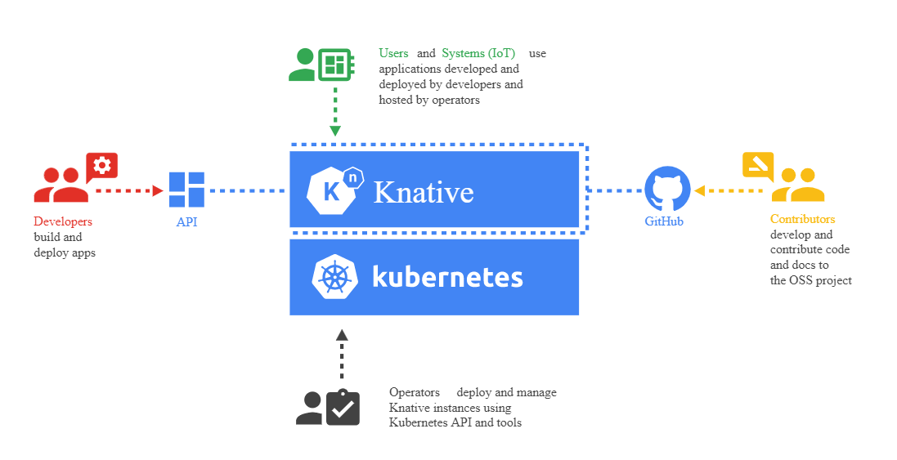

`Knative == v0.12`: https://knative.dev/v0.12-docs/install/knative-with-gke/
`Knative == v0.14`: https://knative.dev/docs/install/any-kubernetes-cluster/

### ~~Prerequisite~~

```sh
kubectl apply -f https://raw.githubusercontent.com/knative/serving/release-0.14/third_party/istio-1.4.7/istio-knative-extras.yaml
```

```sh
# # For Knative 0.14, Istio 1.4
# ./get-extra-for-istio-1.4-knative-v0.14.sh
# cd knative-serving-extra-istio-1.4-latest && \
# kubectl apply -f istio-crds.yaml && \
# kubectl apply -f istio-minimal.yaml && \
# kubectl apply -f istio-ci-mesh.yaml && \
# kubectl apply -f istio-knative-extras.yaml

# # kubectl apply -f values.yaml && \
# # kubectl apply -f values-extras.yaml && \
# # kubectl apply -f values-lean.yaml && \
# # kubectl apply -f values-local.yaml
# cd ..
```

|  |
| ----- |
Installing cluster-local-gateway for serving cluster-internal traffic
If you installed Istio, you can install a cluster-local-gateway within your Knative cluster so that you can serve cluster-internal traffic. If you want to configure your revisions to use routes that are visible only within your cluster, install and use the cluster-local-gateway

1. Install the `CRDs(Custom Resource Definitions)`
2. Install the core components of `Serving`

`Knative >= v0.14.0`
```sh
./install_knative-v0.14-istio.sh
```

### Serving Components
```sh
# 1. Install the `CRDs(Custom Resource Definitions)`
kubectl apply --filename https://github.com/knative/serving/releases/download/v0.14.0/serving-crds.yaml
# 2. Install the core components of `Serving`
kubectl apply --filename https://github.com/knative/serving/releases/download/v0.14.0/serving-core.yaml
```

#### Pick a networking layer (`Istio`)
```sh
# 3-1. Install the Knative Istio controller:
kubectl apply --filename https://github.com/knative/serving/releases/download/v0.14.0/serving-istio.yaml
# 3-2. Fetch the External IP or CNAME:
kubectl --namespace istio-system get service istio-ingressgateway
# Save this for configuring DNS below.
```

#### 4. Configure DNS: Magic DNS (`xip.io`)

We ship a simple Kubernetes Job called “default domain” that will (see caveats) configure Knative Serving to use xip.io as the default DNS suffix.

**Caveat**: This will only work if the cluster LoadBalancer service exposes an IPv4 address, so it will not work with IPv6 clusters, AWS, or local setups like Minikube. For these, see “Real DNS”.
```sh
kubectl apply --filename https://github.com/knative/serving/releases/download/v0.14.0/serving-default-domain.yaml
```

#### 5. Monitor all Knative components are running:
```sh
kubectl get pods --namespace knative-serving
```

#### 6. Optional Serving extensions
##### 6-1. TLS with cert-manager
```sh
# Knative supports automatically provisioning TLS certificates via cert-manager.
# The following commands will install the components needed to support the
# provisioning of TLS certificates via cert-manager.

# 6-1-1. Install `cert-manager 0.12.0 and higher

# 6-1-2 Install the component that integrates Knative with cert-manager:
kubectl apply --filename https://github.com/knative/serving/releases/download/v0.14.0/serving-hpa.yaml
kubectl apply --filename https://github.com/knative/serving/releases/download/v0.14.0/serving-cert-manager.yaml
kubectl apply --filename https://github.com/knative/serving/releases/download/v0.14.0/serving-nscert.yaml
```

### 7. Eventing Components

```sh
kubectl apply --filename https://github.com/knative/eventing/releases/download/v0.14.0/eventing-crds.yaml
kubectl apply --filename https://github.com/knative/eventing/releases/download/v0.14.0/eventing-core.yaml
# GCP Pub/Sub Case
kubectl apply --filename https://github.com/google/knative-gcp/releases/download/v0.14.0/cloud-run-events.yaml
kubectl apply --filename https://github.com/knative/eventing/releases/download/v0.14.0/channel-broker.yaml
```

---

### 8. Observability Plugins

#### Install Core

```sh
kubectl apply --filename https://github.com/knative/serving/releases/download/v0.14.0/monitoring-core.yaml
```

#### Plugins for Prometheus and Grafana

```sh
kubectl apply --filename https://github.com/knative/serving/releases/download/v0.14.0/monitoring-metrics-prometheus.yaml
```

#### Plugins for ELK stack

```sh
kubectl apply --filename https://github.com/knative/serving/releases/download/v0.14.0/monitoring-logs-elasticsearch.yaml
```

#### Plugins for Jaeger(Standalone)

```sh
kubectl apply --filename https://github.com/knative/serving/releases/download/v0.14.0/monitoring-tracing-jaeger-in-mem.yaml
```

#### Plugins for Zipkin(Standalone)

```sh
kubectl apply --filename https://github.com/knative/serving/releases/download/v0.14.0/monitoring-tracing-zipkin-in-mem.yaml
```


---

<https://knative.dev/docs/serving/cluster-local-route/>

## Creating a private cluster-local service
By default services deployed through Knative are published to an external IP address, making them public services on a public IP address and with a public URL.

While this is useful for services that need to be accessible from outside of the cluster, frequently you may be building a backend service which should not be available off-cluster.

Knative provides two ways to enable private services which are only available inside the cluster:

1. To make all services only cluster-local, change the default domain to svc.cluster.local by editing the config-domain config map. This will change all services deployed through Knative to only be published to the cluster, none will be available off-cluster.
2. To make an individual service cluster-local, the service or route can be labeled in such a way to prevent it from getting published to the external gateway.

## Change `default-domain`: `example.com` to `svc.local`

<https://knative.dev/docs/serving/using-a-custom-domain/>

By default, Knative Serving routes use `example.com` as the default domain.
The fully qualified domain name for a route by default is `{route}.{namespace}.{default-domain}`.

```sh
$ kubectl edit cm config-domain --namespace knative-serving

```
:warining:
Routes having domain suffix of `'svc.cluster.local'` will not be exposed through `Ingress`. You can define your own label selector to assign that domain suffix to your `Route` here, or you can set the label
`"serving.knative.dev/visibility=cluster-local"`

## Label a service to be `cluster-local`

```sh
# To label the KService:
$ kubectl label kservice ${KSVC_NAME} serving.knative.dev/visibility=cluster-local

# To label a route:
$ kubectl label route ${ROUTE_NAME} serving.knative.dev/visibility=cluster-local

# To label a Kubernetes service:
$ kubectl label route ${SERVICE_NAME} serving.knative.dev/visibility=cluster-local
```

Example: `helloworld-go` service
```sh
$ kubectl label kservice helloworld-go serving.knative.dev/visibility=cluster-local
$ kubectl get ksvc helloworld-go
```

The service returns the a URL with the `svc.cluster.local` domain, indicating the service is only available in the cluster local network.


---

## Knative <= v0.12.0
```sh
# 1. Install the `CRDs(Custom Resource Definitions)`
$ kubectl apply --selector knative.dev/crd-install=true \
    --filename https://github.com/knative/serving/releases/download/v0.12.0/serving.yaml \
    --filename https://github.com/knative/eventing/releases/download/v0.12.0/eventing.yaml \
    --filename https://github.com/knative/serving/releases/download/v0.12.0/monitoring.yaml

# 2. Install the core components of `Serving`
$ kubectl apply --filename https://github.com/knative/serving/releases/download/v0.12.0/serving.yaml \
    --filename https://github.com/knative/eventing/releases/download/v0.12.0/eventing.yaml \
    --filename https://github.com/knative/serving/releases/download/v0.12.0/monitoring.yaml

# 3. Monitor all Knative components are running:
$ kubectl get pods --namespace knative-serving
$ kubectl get pods --namespace knative-eventing
$ kubectl get pods --namespace knative-monitoring
```


Custom ingressgateway <https://knative.dev/docs/serving/setting-up-custom-ingress-gateway/>